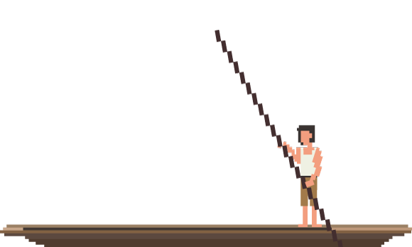

# punter.js

<p align="center"></p>

A simple, dependency-free 2D game engine for the browser. No build step, no frameworks - just one script tag.

**Features**
* **Auto-scaling** - sprites automatically reposition on resize
* **Retina support** - renders at up to 2× device pixel ratio
* **Pixel-accurate collision** - bounding boxes ignore transparent pixels

## Contents

- [Install](#install)
- [Run the Example](#run-the-example)
- [How it Works](#how-it-works)
- [Setup](#setup)
- [Scenes](#scenes)
- [Events](#events)
- [Sprites](#sprites)
- [Sound](#sound)
- [Input](#input)
- [Engine Properties](#engine-properties)
- [Game Loop Control](#game-loop-control)
- [CSS & HTML Hooks](#css--html-hooks)
- [Debug Mode](#debug-mode)
- [Browser Support](#browser-support)

## Install

Download `punter.js` and include it with a script tag before your game code:

```html
<!doctype html>
<html>
  <head>
    <script src="punter.js"></script>
  </head>
  <body>
    <canvas id="game"></canvas>
    <script>
      // your game code here
    </script>
  </body>
</html>
```

## Run the Example

The repo includes a Pong game in `games/pong.html`. Open it with a local web server - browsers block local file loading without one.

```bash
npm start
```

Then open **http://localhost:3000/games/pong.html** in your browser.

> `npm start` uses `npx serve` - no install step needed beyond having Node.js.

## How it Works

Every punter.js game follows the same three-step pattern:

1. **setup** - specify which canvas to use and which images/sounds to preload
2. **scene** - define a named scene (level, menu, etc.) with update/draw logic
3. **ready** - switch to a scene once everything has loaded

```js
// 1. Load assets
punter.setup({
  canvas: '#game',
  images: { player: 'images/player.png' },
  sounds:  { jump: 'sounds/jump.mp3' }
});

// 2. Define a scene
punter.scene('level1', function () {

  var player = punter.createSprite({ id: 'player', key: 'player', x: '50%', y: '50%' });

  punter.on('update', function () {
    if (punter.keys['ArrowRight']) player.moveX(3);
    if (punter.keys['ArrowLeft'])  player.moveX(-3);
    if (punter.keys['ArrowUp'])    player.moveY(-3);
    if (punter.keys['ArrowDown'])  player.moveY(3);
  });

  punter.on('draw', function () {
    player.draw(this); // 'this' is the canvas 2D context
  });
});

// 3. Start when ready
punter.on('ready', function () {
  punter.go('level1');
});
```

## Setup

Call this once at the start. The `ready` event fires once all assets have loaded.

```js
punter.setup({
  canvas: '#game',   // CSS selector or HTMLCanvasElement
  debug: false,      // true = show FPS and bounding boxes
  images: {
    player: 'images/player.png',
    coin:   'images/coin.png'
  },
  sounds: {
    jump: 'sounds/jump.mp3'
  }
});
```

Option    | Required | Description
----------|----------|------------------------------------------------
`canvas`  | Yes      | CSS selector (`'#game'`) or `HTMLCanvasElement`
`images`  | No       | Key/path pairs of images to preload
`sounds`  | No       | Key/path pairs of audio files to preload
`debug`   | No       | Enables the debug overlay. Default: `false`

## Scenes

Scenes are the different screens in your game - a menu, level 1, game over. Define each with `punter.scene()`, then switch between them with `punter.go()`. Switching scenes automatically clears the previous update/draw handlers.

```js
punter.scene('menu', function () {
  punter.on('update', function () {
    if (punter.mouse.clicked) punter.go('level1');
  });
});

punter.scene('level1', function () {
  // level setup here
});
```

## Events

Register handlers with `punter.on()`. Each event can only have one handler at a time - calling `punter.on()` again for the same event replaces the previous one.

```js
punter.on('ready', function () {
  // fires once - all assets loaded, safe to create sprites
  punter.go('level1');
});

punter.on('update', function () {
  // fires ~60 times/sec - move things, check input, check collisions
});

punter.on('draw', function () {
  // fires every frame - 'this' is the canvas 2D context
  player.draw(this);
});

punter.on('resize', function () {
  // fires when the browser window resizes
});
```

## Sprites

A sprite is any image in your game - a character, enemy, coin, background tile. Create one with `punter.createSprite()`:

```js
var player = punter.createSprite({
  id:  'player',  // unique name - no two sprites can share one
  key: 'player',  // matches a key from config.sprites
  x:   '50%',    // position - number (pixels) or percent string
  y:   '80%'
});
```

### Creation Options

Option           | Default    | Description
-----------------|------------|----------------------------------------------------------------------------------------------------
`id`             | -          | **Required.** Unique name for this sprite.
`key`            | -          | **Required.** Image key from `config.images`. Pass an array (`['frame1','frame2']`) for animation.
`x`              | -          | **Required.** Horizontal position in pixels or `'50%'`.
`y`              | -          | **Required.** Vertical position in pixels or `'50%'`.
`w`              | auto       | Width in pixels or percent. Inferred from the image if omitted.
`h`              | auto       | Height in pixels or percent. Inferred from the image if omitted.
`preserveAspect` | `true`     | Maintain aspect ratio when only one dimension is set.
`collidable`     | `true`     | Compute a collision bounding box for this sprite.
`repeatX`        | `false`    | Tile horizontally across the canvas (e.g. a floor).
`repeatY`        | `false`    | Tile vertically across the canvas (e.g. a wall).
`clipHeight`     | `null`     | Limit the drawn height in pixels - useful for health/fill bars.
`clipFrom`       | `'bottom'` | Which end to clip from: `'top'` or `'bottom'`.

### Sprite Properties

Property    | Description
------------|-----------------------------------------------------------------------------------------
`x`, `y`    | Position in pixels. Set directly to move the sprite.
`w`, `h`    | Size in pixels.
`visible`   | `true` if any part of the sprite is within the canvas. Read-only.
`bounds`    | Pixel-accurate bounding box `{ x, y, w, h }`. Updated each frame. Read-only.
`frame`     | Override the current animation frame index. Set to `null` to let `animate()` control it.
`destroyed` | `true` after `destroy()` has been called. Read-only.

### Sprite Methods

#### `sprite.draw(ctx)`
Draws the sprite. Call inside your `draw` handler - `ctx` is `this`.

```js
punter.on('draw', function () {
  player.draw(this);
  enemy.draw(this);
});
```

#### `sprite.moveX(dx)` / `sprite.moveY(dy)`
Move by `dx` / `dy` pixels. Call in `update`.

```js
punter.on('update', function () {
  if (punter.keys['ArrowRight']) player.moveX(3);
  if (punter.keys['ArrowLeft'])  player.moveX(-3);
});
```

#### `sprite.center(offsetX?, offsetY?)`
Centre the sprite on the canvas. Optional offsets shift it from the centre.

```js
player.center();        // perfectly centred
player.center(0, -50);  // centred, 50px above the middle
```

Use `sprite.centerX()` or `sprite.centerY()` to centre on one axis only.

#### `sprite.animate(delayMs)`
Advance to the next animation frame. Requires `key` to be an array of image keys.

```js
var run = punter.createSprite({
  id:  'runner',
  key: ['run1', 'run2', 'run3'],
  x: 100, y: 200
});

punter.on('update', function () {
  run.animate(120); // new frame every 120ms
});
```

Set `sprite.frame = 2` to jump to a specific frame. Set it to `null` to let `animate()` take over again.

#### `sprite.bounce(range?, speed?)`
Float up and down in a smooth wave. Call every frame in `update`.

```js
punter.on('update', function () {
  coin.bounce(6, 12); // 6px range, speed 12 (higher = slower)
});
```

#### `sprite.isCollidingWith(other)`
Returns `true` if the bounding boxes of two sprites overlap. Both must have `collidable: true` (the default). Always call `sprite.draw()` before checking - bounds are updated during draw.

```js
punter.on('update', function () {
  if (player.isCollidingWith(bullet)) {
    bullet.destroy();
    punter.playSound('hit');
  }
});
```

#### `sprite.destroy()`
Removes the sprite. All subsequent `draw()` calls are silently ignored.

#### Scrolling

Method                                                   | Description
---------------------------------------------------------|------------------------------------------------------------------------
`sprite.parallaxScrollX(speed, respawnAfterMs, offset?)` | Scroll horizontally. Respawns from the opposite edge after a delay.
`sprite.parallaxScrollY(speed, respawnAfterMs, offset?)` | Scroll vertically. Respawns from the opposite edge after a delay.
`sprite.loopScrollX(speed)`                              | Scroll horizontally and wrap immediately. Good for looping backgrounds.

```js
punter.on('update', function () {
  cloud.parallaxScrollX(-2, 1000); // move left, respawn after 1s
  ground.loopScrollX(-3);          // loop left seamlessly
});
```


## Sound

```js
punter.setup({
  sounds: { jump: 'sounds/jump.mp3', music: 'sounds/theme.mp3' }
});

punter.on('ready', function () {
  punter.playSound('music', { loop: true, volume: 0.5 }); // background music
  punter.go('level1');
});

punter.playSound('jump');    // one-shot effect
punter.stopSound('music');   // stop a playing sound
```

### `punter.playSound(name, options?)`

Option   | Default | Description
---------|---------|--------------------------------------------
`volume` | `1`     | Volume from `0` (silent) to `1` (full).
`loop`   | `false` | Repeat indefinitely.
`speed`  | `1`     | Playback speed. `0.5` = half, `2` = double.
`once`   | `false` | If `true`, `stopSound()` cannot stop it.

### `punter.stopSound(name)`
Stops all playing instances of the named sound.


## Input

Check input state inside your `update` handler each frame. Touch events on mobile are automatically translated into mouse events.

### Keyboard

```js
punter.on('update', function () {
  if (punter.keys['ArrowLeft'])  player.moveX(-3);
  if (punter.keys['ArrowRight']) player.moveX(3);
  if (punter.keys[' '])          player.moveY(-8); // spacebar
  if (punter.keys['Escape'])     punter.go('menu');
});
```

Key names follow the browser's [`KeyboardEvent.key`](https://developer.mozilla.org/en-US/docs/Web/API/KeyboardEvent/key) values.

### Mouse & Touch

```js
punter.on('update', function () {
  if (punter.mouse.clicked) {
    fireAt(punter.mouse.x, punter.mouse.y);
  }
});
```

Property               | Description
-----------------------|---------------------------------------------------
`punter.mouse.x`       | X position of the last click/tap in canvas pixels.
`punter.mouse.y`       | Y position of the last click/tap in canvas pixels.
`punter.mouse.clicked` | `true` for one update tick after a click or tap.

### `punter.clearInput()`
Resets all key states and clears `mouse.clicked`. Called automatically on `punter.go()`.


## Engine Properties

Property             | Description
---------------------|-----------------------------------------------------
`punter.width`       | Canvas width in pixels (DPR-adjusted).
`punter.height`      | Canvas height in pixels (DPR-adjusted).
`punter.dpr`         | Device pixel ratio (capped at `2`).
`punter.frame`       | Frame counter, cycling 1–60.
`punter.running`     | `true` if the game loop is running.
`punter.paused`      | `true` if the loop is paused.
`punter.isMobile`    | `true` on mobile devices.
`punter.orientation` | `'portrait'` or `'landscape'`.
`punter.sceneName`   | Name of the current scene.
`punter.debug`       | Toggle debug mode at runtime: `punter.debug = true`.

### `punter.getSprite(id)`
Returns a sprite by ID, or `null` if not found.

```js
var player = punter.getSprite('player');
```


## Game Loop Control

The loop starts automatically when you call `punter.go()`. Pause and resume it manually - for example, when showing a pause menu.

```js
punter.pause();   // stop update + draw
punter.resume();  // restart
punter.redraw();  // single redraw without running update logic
```


## CSS & HTML Hooks

The engine sets attributes on `<html>` as the game runs. Use them in CSS to react to game state.

Attribute                 | When set
--------------------------|-------------------------------------------------------------
`data-punter-loading`     | Present while assets are loading; removed when `ready` fires
`data-punter-scene`       | Updated on every `punter.go()` - value is the scene name
`data-punter-orientation` | `"portrait"` or `"landscape"`, updated on resize
`data-punter-device`      | `"mobile"` or `"desktop"`, set on init

It also exposes CSS variables on `:root`, updated on resize:

Variable       | Description
---------------|------------------------------------------
`--punter-vpw` | Viewport width in pixels (e.g. `375px`).
`--punter-vph` | Viewport height in pixels (e.g. `667px`).

```css
/* hide loader once assets are ready */
html[data-punter-loading] #loader { display: block; }
html:not([data-punter-loading]) #loader { display: none; }
```


## Debug Mode

```js
punter.setup({ canvas: '#game', debug: true }); // enable at startup
punter.debug = true;                            // or toggle at runtime
```

When active, the engine draws:
- **FPS** and canvas resolution in the bottom-right corner
- **Red bounding boxes** around each collidable sprite
- **Position and size labels** near each sprite


## Browser Support

Works in all modern browsers (Chrome, Firefox, Safari, Edge). For older browsers, polyfills for `fetch` and `Promise` are enough.

Requires: `fetch`, `Promise`, `requestAnimationFrame`, `AudioContext`, canvas `getImageData`.

> Don't manually resize the canvas - the engine manages that internally.

## License

[MIT License](LICENSE). Built by the [Orca Scan Team](https://orcascan.com/about-us) to power [OrcaCam](https://orcascan.com/game).