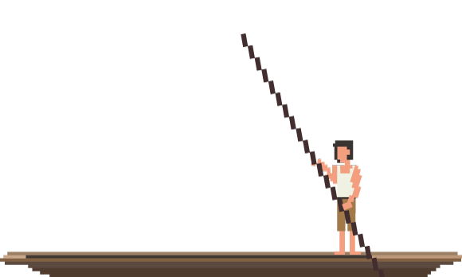

# punter.js

[](https://github.com/orca-scan/punter.js/actions/workflows/ci.yml)
[](https://www.npmjs.com/package/punter.js)
[](https://github.com/orca-scan/punter.js/blob/master/LICENSE)

<p align="center"></p>

A simple 2D JavaScript game engine built for learning.

Created by the Orca Scan team, Punter.js powers [OrcaCam](https://orcascan.com/game) and was designed to help students and new developers learn JavaScript by making games. Its deliberately simple design keeps the important parts visible instead of hiding them behind frameworks and abstractions.

**New to game programming?** [Build your first game](first-game.md) in under 15 minutes with the step-by-step guide⁠.

## Game programming terms
- **Canvas** - an HTML element you draw on with JavaScript. Every punter.js game lives inside one `<canvas>`
- **Sprite** - an image-based game object (player, enemy, coin). It has a position, can move, animate and collide
- **Scene** - one screen of your game (menu, level, game over). Sprites and logic are set up inside a scene
- **Game loop** - code that runs 60 times per second to move sprites, check collisions and redraw the screen

## Examples

This project includes a few example games to help you get started. Download and run the examples locally using:

```bash
git clone https://github.com/orca-scan/punter.js.git
cd punter.js
npm install
npm start
```

This starts a local server on port 4000 and opens the games index in your browser.

## Quick Start

```html
<canvas id="game"></canvas>
<script src="punter.js"></script>
<script>

  // load assets and bind to a canvas (must be called first)
  punter.setup({
    canvas: '#game',
    debug: false, // set true to see FPS, bounds boxes, sprite labels
    images: {
      player: 'images/player.png',
      enemy: 'images/enemy.svg'
    },
    sounds: {
      jump: 'sounds/jump.mp3'
    }
  });

  // define a scene - create sprites and register update/draw handlers inside
  punter.scene('level1', function () {

    // create a sprite using the 'player' image loaded above
    var player = punter.createSprite({
      id: 'player',   // unique id - no two sprites can share one
      image: 'player', // key from config.images
      x: 50,           // pixels from left edge of canvas
      y: 50            // pixels from top edge of canvas
    });

    // runs ~60 times/sec - move things, read input, check collisions
    punter.on('update', function () {
      if (punter.isKeyDown('right')) player.moveX(2);
    });

    // runs once per frame after sprites draw - use for score text, HUD, overlays
    punter.on('draw', function (ctx) {
      // ctx is the canvas 2D context
    });
  });

  // go() a specific scene - can be called immediately
  punter.go('level1');
</script>
```

## 1. Setup

Call `punter.setup(config)` once at the start. It loads images and sounds ahead of time, sets up the canvas, and fires the `ready` event when everything's finished loading. Config options are:

Option   | Type           | Description
:--------|:---------------|:--------------------------------------------------------
`canvas` | string/element | CSS selector or a `<canvas>` element
`debug`  | boolean        | Shows FPS counter, sprite bounds, and position labels
`images` | object         | `{ key: imageUrl }` map - preloaded before `ready` fires
`sounds` | object         | `{ key: soundUrl }` map - decoded before `ready` fires

The `images` and `sounds` options are just name-to-file lookups - you pick a short name (like `player`) and point it at the actual file (like `images/player.png`), then refer to it by that short name everywhere else in your code.

## 2. Scenes

A scene is a named function that sets up `update`/`draw` handlers and creates sprites - think of it as "everything that happens on this particular screen of the game."

```js
punter.scene('menu', function () {
  // set up sprites and handlers here
});

punter.go('menu'); // destroys sprites from the previous scene, then switches and starts the loop
```

`scene()` just *registers* a scene under a name - it doesn't run anything yet. `go()` is what actually switches to it and starts things moving. You'll usually have several scenes (a menu, a level, a game-over screen) and use `go()` to jump between them, e.g. `punter.go('gameOver')` when the player loses.

`punter.go()` can be called before `setup()` has finished loading - it queues the scene name and runs it automatically once assets are ready, so you don't need to wait on the `ready` event just to call `go()`. It always tears down every sprite from the current scene and clears input state before running the new scene's handler - scenes don't need to clean up after themselves, the engine does it for you.

## 3. Sprites

A sprite is any game object with a position — the player, an enemy, a coin, a wall. Give it a unique `id`, tell it how to look (an `image`, a `vector` draw function, or both), and where to place it (`x`, `y`).

```js
var enemy = punter.createSprite({
  id: 'enemy1',           // must be unique
  image: 'enemy',          // matches a key from config.images (or an array of keys for animation)
  vector: null,            // optional draw function — see "Vector sprites" below
  x: 100, y: 200,          // position (number or '%' string, e.g. '50%')
  w: 32, h: 32,            // optional size (auto-detected from image if omitted; required for vector-only)
  preserveAspect: true,    // maintain image aspect ratio (default: true)
  collidable: true,        // computes bounding box for collisions (default: true)
  boundsMode: 'pixel',     // 'pixel' = tight box around opaque pixels, 'rect' = full sprite w/h
  repeatX: false,          // tile horizontally across the canvas (default: false)
  repeatY: false,          // tile vertically across the canvas (default: false)
  clipHeight: null,        // clip sprite to this height in pixels (null = no clip)
  clipFrom: 'bottom',      // clip from 'top' or 'bottom' (default: 'bottom')
  outline: 'red'           // optional debug outline color
});
```

`x` and `y` are the sprite's position in pixels, measured from the top-left corner of the canvas - so `x: 0, y: 0` is the top-left, and increasing `x` moves right, increasing `y` moves down. Once created, `enemy` is a normal JavaScript object you keep a reference to and call methods on, like `enemy.moveX(5)`.

### Vector sprites

Not every sprite needs an image file. Pass a `vector` function to draw the sprite with canvas code — useful for simple shapes, procedural graphics, or games that don't use image files at all. The engine calls it each frame with `(ctx, w, h)`, where `ctx` is the canvas context already translated to the sprite's top-left corner.

```js
// a triangle drawn with code instead of a PNG
var ship = punter.createSprite({
  id: 'ship',
  x: 100, y: 200,
  w: 36, h: 36,
  vector: function (ctx, w, h) {
    ctx.strokeStyle = '#00ffcc';
    ctx.lineWidth = 2;
    ctx.beginPath();
    ctx.moveTo(w / 2, 0);    // tip
    ctx.lineTo(w, h);         // bottom-right
    ctx.lineTo(0, h);         // bottom-left
    ctx.closePath();
    ctx.stroke();
  }
});
```

When both `image` and `vector` are set, the image draws first and the vector function draws on top — useful for overlays like health bars or damage effects. Vector-only sprites default to `boundsMode: 'rect'` since there is no image to scan.

### sprite methods

Method                                     | Description
:------------------------------------------|:--------------------------------------------------------------------
`sprite.moveX(dx)`                         | Move right (`+dx`) or left (`-dx`) by pixels
`sprite.moveY(dy)`                         | Move down (`+dy`) or up (`-dy`) by pixels
`sprite.center(offsetX?, offsetY?)`        | Centre on canvas; use `centerX()` / `centerY()` for one axis
`sprite.animate(delayMs)`                  | Advance animation frame; requires `image` to be an array
`sprite.bounce(range, speed)`              | Smooth up-and-down float anchored to creation position
`sprite.parallaxScrollX(speed, respawnMs)` | Scroll horizontally and respawn from the opposite edge after a delay
`sprite.parallaxScrollY(speed, respawnMs)` | Scroll vertically and respawn from the opposite edge after a delay
`sprite.loopScrollX(speed)`                | Scroll horizontally and wrap immediately (seamless background loops)
`sprite.isCollidingWith(other)`            | `true` if bounding boxes overlap; call inside `update`
`sprite.destroy()`                         | Remove from engine; further `draw()` calls are silently ignored

### sprite properties

Property         | Description
:----------------|:-----------------------------------------------------------------
`sprite.visible` | `true` if any part of the sprite is within canvas bounds
`sprite.seen`    | `true` once the sprite has been visible at least once. Read/write
`sprite.actualW` | Drawn width in pixels, same as `w`
`sprite.actualH` | Drawn height in pixels, accounting for `clipHeight` if set

## 4. Input

Call `punter.isKeyDown()` inside your `update` handler each frame. Pass one or more friendly key names - returns `true` if any of them are held (OR logic). Use `+` for combos that require all keys at once (AND logic).

| Name | Key |
|------|-----|
| `'left'` `'right'` `'up'` `'down'` | Arrow keys |
| `'space'` | Spacebar |
| `'enter'` | Enter |
| `'escape'` / `'esc'` | Escape |
| `'shift'` `'ctrl'` `'alt'` | Modifier keys |
| `'a'` – `'z'` | Letter keys (case-insensitive) |

```js
punter.scene('level1', function () {

  var player = punter.createSprite({ id: 'player', image: 'player', x: 100, y: 100 });

  punter.on('update', function () {

    // arrow keys or WASD - multiple args = OR (true if any held)
    if (punter.isKeyDown('left', 'a'))  player.moveX(-3);
    if (punter.isKeyDown('right', 'd')) player.moveX(3);
    if (punter.isKeyDown('up', 'w'))    player.moveY(-3);
    if (punter.isKeyDown('down', 's'))  player.moveY(3);
    if (punter.isKeyDown('space'))      punter.playSound('jump');

    // + combos = AND (all keys must be held)
    if (punter.isKeyDown('shift+a'))    player.moveX(-6); // fast move

    // pointer.clicked is true for one frame after a tap or click (good for menus, shooting)
    if (punter.pointer.clicked) {
      player.x = punter.pointer.x;
      player.y = punter.pointer.y;
    }

    // isPointerDown() is true while a finger or button is held (good for movement, steering)
    if (punter.isPointerDown()) {
      player.x = punter.pointer.x;
      player.y = punter.pointer.y;
    }
  });
});
```

| Property/Method                     | Description                                                                                          |
|-------------------------------------|------------------------------------------------------------------------------------------------------|
| `punter.isKeyDown('left', 'a')`     | `true` while any of the given keys is held; use `+` for combos e.g. `'shift+a'`                     |
| `punter.pointer.x`                  | Current pointer X in canvas pixels (always up to date)                                               |
| `punter.pointer.y`                  | Current pointer Y in canvas pixels (always up to date)                                               |
| `punter.pointer.clicked`            | `true` for one `update` tick after a click or tap                                                    |
| `punter.isPointerDown(button)`      | `true` while the named button is held (`'left'`, `'right'`, `'middle'`; defaults to `'left'`)        |
| `punter.pointer.down`               | `true` while the primary button or finger is held down                                               |
| `punter.clearInput()`               | Resets all key and pointer states. Called automatically on `punter.go()`                             |

## 5. Sound

```js
punter.playSound('jump', { volume: 0.8, loop: false, speed: 1 });
punter.stopSound('jump');
```

`playSound` takes the short name you gave a sound in `setup()`'s `sounds` option, plus optional settings - `volume` (0 to 1), `loop` (repeat forever or not), and `speed` (1 is normal, 2 is double speed, etc.).

`playSound` on an already-playing sound restarts it rather than layering. In practice: calling `playSound('jump')` twice quickly won't give you two overlapping jump sounds, it'll just restart the one sound.

## 6. Events

`punter.on(eventName, fn)` Events are how you plug your own code into the engine's game loop - you give it a function, and the engine calls that function at the right moment.

Event name | When it fires
:----------|:-----------------------------------------------------------------------------------------------------------------------------------------------------
`ready`    | Once, after all assets are loaded. Not needed just to call `go()`
`update`   | ~60 times/sec (fixed timestep) - put game logic here
`draw`     | Once per animation frame, after sprites auto-draw - use for HUD/overlays
`resize`   | Whenever the canvas resizes
`go`       | Whenever `punter.go()` switches scenes

```js
punter.on('ready', function () {
  // all images and sounds are loaded - safe to start
  punter.go('level1');
});

punter.on('update', function () {
  // runs ~60 times/sec - move things, read input, check collisions
  if (punter.isKeyDown('right')) player.moveX(3);
  if (player.isCollidingWith(enemy)) punter.go('gameOver');
});

punter.on('draw', function (ctx) {
  // runs after sprites draw - ctx is the canvas 2D context
  // use for score text, HUD, overlays; sprites draw themselves automatically
  ctx.fillStyle = 'white';
  ctx.fillText('Score: ' + score, 10, 20);
});

punter.on('resize', function () {
  // canvas resized - reposition any manually-placed elements
  player.center();
});

punter.on('go', function (sceneName) {
  // fires after every scene switch - useful for analytics or shared teardown
});
```

## Gotchas for Beginners

- **Sprite IDs must be unique** - reusing one throws an error
- **`repeatX` and `repeatY` are mutually exclusive** on a single sprite
- Percentage strings (`'50%'`) for `x`/`y`/`w`/`h` are resolved relative to canvas size
- Don't manually resize the canvas - the engine owns that via its own `resize()` handling
- `punter.setup()` must be called before `createSprite`, `playSound`, `pause` etc

## How the Game Loop Works

Once you call `punter.go()`, the engine runs a loop 60 times every second. Each loop does this:

1. Runs your `update` code (move things, check collisions)
2. Clears the screen
3. Draws all sprites
4. Runs your `draw` code (score, HUD)
5. Starts again

Each `update` always moves the game forward by the same amount of time - so your game runs at the same speed on fast and slow devices. Without this, a slow phone would make everything move in slow motion.

Use `punter.pause()` and `punter.resume()` to freeze and unfreeze the loop - good for a pause menu.

`punter.redraw()` redraws the screen without running any game logic - useful when the game is paused.

---

## Technical details

You do not need to understand this section to build a game. These are some of the details Punter.js handles for you:

- **Content-trimmed bounding boxes for collision.** The overlap test itself is a plain AABB (rectangle overlap) check, but the box isn't the full sprite sheet - `getBounds` does a per-pixel alpha scan of each image once, finds the tightest rect containing non-transparent pixels, and caches it per image key. So hitboxes match the visible artwork instead of whatever padding is baked into the source image.
- **A real fixed-timestep loop.** The loop runs `update` on a 60Hz accumulator, decoupled from `draw`, with a 100ms-per-frame cap to avoid a spiral of death after a tab is backgrounded. Game logic behaves the same on a 60Hz and 144Hz screen - most hand-rolled canvas code skips this and gets frame-rate-dependent movement.
- **Pointer, touch, and stylus are unified.** One `keys`/`pointer` input model backed by the Pointer Events API (with mouse/touch fallback for older browsers), with coordinate mapping that accounts for canvas CSS scaling (`getBoundingClientRect` + scale factor). Covers mouse, touchscreen, and stylus/pen with no extra game code.
- **DPR-aware canvas buffer.** The canvas backing buffer is sized at `internalResolution × devicePixelRatio` (capped at 2x) so art stays sharp on retina screens. All game coordinates - sprite positions, movement, pointer, and custom canvas drawing - use logical pixels; the engine handles the physical scaling internally.

None of this is exotic, it's just the stuff that's easy to get wrong when you write it yourself.

## What it doesn't do

- **No physics.** No gravity, velocity, acceleration model - `isCollidingWith` tells you two sprites overlap; what happens next (bounce back, stop, lose a life) is up to you.
- **No tilemaps.** No Tiled import, no level-editor pipeline.
- **No plugin system, no modules.** Single file, ~1800 lines, vanilla ES5-style JS, one global (`punter`).
- **No WebGL.** Canvas 2D only.

If you need physics or tilemaps, look at Phaser or Kaboom/Kaplay instead.

## Responsive Canvas

The canvas always matches the real screen's aspect ratio - landscape screens get a landscape canvas, portrait screens get a portrait canvas. There's no portrait lock and no letterboxing (black bars).

Internally, `resize()` uses a 375×667 reference resolution purely as a starting point for arithmetic: it picks whichever axis (width or height) that reference matches the current orientation on, holds that axis fixed, and computes the other axis from the screen's actual ratio. The result is an internal resolution whose aspect ratio equals the screen's aspect ratio exactly, every time - 375×667 never appears in the final canvas size except by coincidence.

The backing buffer is additionally scaled by devicePixelRatio (capped at 2x) for crisp rendering on retina displays. Sprites automatically reposition/resize on resize - you don't need to do anything manually.

## Debug Mode

Set `debug: true` in `setup()` (or `punter.debug = true` later) to see:

- FPS, frame count, canvas size, and orientation (bottom-right overlay)
- Red collision-box outlines on every collidable sprite
- Position/size labels under each sprite

This is genuinely useful while learning - turning it on lets you *see* the invisible collision boxes and frame rate, which makes it much easier to understand why something isn't colliding the way you expect.

Debug mode, device type, and orientation are also reflected as `data-punter-*` attributes on `<html>` (e.g. `data-punter-device`, `data-punter-orientation`, `data-punter-scene`) and as `--punter-vpw` / `--punter-vph` CSS custom properties, if you want to hook into them from your own CSS.

## Other engine properties

`punter` exposes a handful of read-only properties and helpers beyond what's covered above:

Property                  | Description
:-------------------------|:-------------------------------------------------------
`punter.sceneName`        | name of the currently active scene
`punter.sprites`          | array of all currently registered sprites
`punter.getSprite(id)`    | get a sprite by id, `null` if not found
`punter.width`            | logical pixel width of the canvas
`punter.height`           | logical pixel height of the canvas
`punter.frame`            | current frame counter (0–59, resets each second)
`punter.totalFrames`      | total frames since the loop started (never resets)
`punter.canvas`           | the `<canvas>` element
`punter.ctx`              | the canvas 2D rendering context
`punter.running`          | `true` if the game loop is running
`punter.paused`           | `true` if the loop is paused
`punter.resized`          | `true` for the frame in which a resize occurred
`punter.isMobile`         | `true` on mobile devices
`punter.isDesktop`        | `true` on non-mobile devices
`punter.orientation`      | `'portrait'` or `'landscape'`

## License

[MIT License](LICENSE). Built by the [Orca Scan Team](https://orcascan.com/about-us).